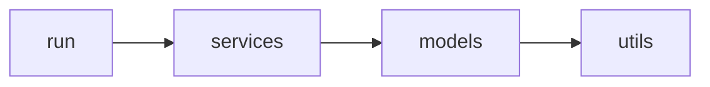

# Banking Transfer Service

A small banking service that loads account balances for a single company and applies
a day's worth of transfers from a CSV file. Money cannot be transferred from an
account if doing so would put its balance below \$0.

> The original challenge specifies Ruby + RSpec; this implementation is written in
> **TypeScript** with an equivalent **Vitest** test suite.

## Requirements

- Node.js >= 20

## Install

```bash
npm install
```

## Run

```bash
npm run run:sample                                  # uses the bundled sample CSVs
npm start <balances.csv> <transfers.csv>         # any two files
```

Example output:

```
Loaded balances:
  1111234522226789: 5000.00
  ...

Transfers: 4 applied, 0 rejected

Applied:
  1111234522226789 -> 1212343433335665: 500.00
  ...

Final balances:
  1111234522226789: 4820.50
  ...
```

Invalid transfers (insufficient funds, or an unknown account) are **skipped and
reported** — a bad row never stops the rest of the day from processing, and every
rejection is listed with its reason.

## Test

```bash
npm test              # run the suite once
npm run test:watch    # watch mode
npm run test:coverage # coverage report
npm run typecheck     # tsc --noEmit
```

## Input format

**Balances** — `account_number, balance`:

```
1111234522226789,5000.00
```

**Transfers** — `from, to, amount`:

```
1111234522226789,1212343433335665,500.00
```

Account numbers are 16 digits. Amounts use up to two decimal places.

## Assumptions

- **No header row.** Every non-blank line is data; blank lines are ignored and
  fields are trimmed.
- **Simple CSV only.** Fields are split on commas — quoted fields, escaped commas,
  and embedded newlines are not supported (account numbers and amounts never
  contain them).
- **Account numbers are exactly 16 digits;** amounts and balances are non-negative
  with up to two decimal places — no sign, currency symbol, or thousands
  separators. Values are a single, implied currency.
- **Accounts must already exist.** Transfers reference accounts from the balances
  file; they never create new ones.
- **Transfers apply in file order** against a running balance, so a later transfer
  sees the effect of earlier ones.
- **A day is processed best-effort, not atomically.** A rejected transfer — unknown
  account, insufficient funds, a self-transfer, or a non-positive amount — is
  skipped and reported; it does not roll back transfers already applied.
- **Malformed input aborts the load.** A structurally invalid row — wrong column
  count, a non-16-digit account number, an unparseable amount, or a duplicate
  account in the balances file — stops the run with an error, rather than being
  reported as a per-transfer rejection.
- **Everything fits in memory.** Files are read whole and balances held in a `Map`,
  sized for one company's single day.

## Design

Organised into three layers with a one-way dependency direction



```
src/
├── models/         domain state & invariants
│   ├── account.ts    balance + the below-$0 rule (canDebit / debit / credit)
│   ├── transfer.ts   value object: from, to, amount
│   └── bank.ts       account collection, lookup by number
├── services/       behaviour & orchestration
│   ├── transferService.ts  apply one/many transfers -> applied | rejected(reason)
│   ├── csvLoader.ts        parse CSV into models (the only file I/O)
│   └── reportService.ts    format balances & transfer results as feedback
├── utils/          pure, reusable helpers
│   ├── money.ts      parse/format between "320.50" and integer cents
│   └── csv.ts        low-level CSV row/field parsing
└── run.ts          CLI: wires loader -> service -> report
```

### Key decisions

- **Money is stored as integer cents.** Floating point cannot represent values like
  `320.50` exactly, which would corrupt balances and the below-\$0 comparison.
  Parsing straight from the CSV string into integer cents keeps every calculation
  exact.
- **The below-\$0 rule lives on `Account`.** The invariant is enforced where the data
  lives, so it cannot be bypassed. `transferService` checks affordability first and
  returns a rejection result rather than relying on a thrown exception.
- **Rejections are values, not exceptions.** `applyTransfer` returns a discriminated
  union (`applied` / `rejected` with a reason), which makes batch processing a simple
  `map` and gives type-safe reporting.
- **I/O is isolated.** Only `csvLoader` touches the filesystem and only `src/run`
  writes to the console, so the domain and services are trivially unit-testable.
- **Storage is in-memory** (`Bank` holds a `Map`), sized for one company and one day.
  Moving to a database would mean a repository behind `Bank` and a new loader — the
  models and `transferService` would be untouched.
